# Software Architecture Document
**Project:** Yarey Wellness Operating System
**Version:** 1.3
**Date:** January 09, 2026

---

## 1. Executive Summary
The Yarey Wellness Operating System is a bespoke, single-page application (SPA) designed to digitize and optimize the daily operations of Yarey Wellness in Phuket. This document outlines the technical architecture, data structures, and core functional modules that power the **Admin Dashboard**, **Point of Sale (POS)**, and **Commission Tracking** systems.

The system is built on a modern **Next.js 14** framework, utilizing client-side persistence mechanisms to ensure zero-latency performance and offline capability for critical operational tasks.

---

## 2. System Architecture

### 2.1 High-Level Diagram
The following diagram illustrates the data flow between user interfaces and the local persistence layer.

```mermaid
graph TD
    subgraph "Presentation Layer (Next.js)"
        AdminDashboard["🖥️ Admin Dashboard (/admin)
        • Host View (Timeline)
        • Menu CMS
        • Pulse Analytics"]
        
        POS["📱 POS Console (/admin/walk-in)
        • Service Grid
        • Group Cart
        • Checkout"]
        
        StaffSettings["⚙️ Staff Settings (/admin/settings)
        • Salesman CRUD
        • Commission Rates"]
    end

    subgraph "Persistence Layer (LocalStorage)"
        DB_Bookings[("(yarey_bookings)
        Transaction Log")]
        
        DB_Treatments[("(yarey_treatments)
        Service Catalog")]
        
        DB_Vouchers[("(yarey_vouchers)
        Prepaid Ledger")]
        
        DB_Salesmen[("(yarey_salesmen)
        Staff Registry")]
    end

    %% Booking Flow
    POS -->|Reads| DB_Treatments
    POS -->|Validates/Redeems| DB_Vouchers
    POS -->|Reads Staff| DB_Salesmen
    POS -->|Writes New Booking| DB_Bookings

    %% Admin Flow
    AdminDashboard -->|Visualizes/Edits| DB_Bookings
    AdminDashboard -->|Manages| DB_Treatments
    AdminDashboard -->|Issues| DB_Vouchers
    AdminDashboard -->|Aggregates Stats| DB_Bookings
    
    %% Staff Flow
    StaffSettings -->|Updates| DB_Salesmen
    AdminDashboard -.->|Reads for Pulse| DB_Salesmen
```



### 2.2 Technology Stack

| Component | Technology | Rationale |
| :--- | :--- | :--- |
| **Framework** | Next.js 14 (App Router) | React Server Components architecture for future scalability. |
| **Styling** | Tailwind CSS | Utility-first CSS for rapid UI development and consistent design system. |
| **Animation** | Framer Motion | High-performance animations for "premium" interface feel. |
| **Persistence** | LocalStorage API | Zero-latency, offline-first data storage for MVP phase. |
| **Icons** | Lucide React | Consistent, lightweight vector iconography. |
| **Utilities** | html2canvas | Client-side generation of branded PNG tickets. |

---

## 3. Module Specifications

### 3.1 Admin Dashboard
**Route:** `/admin`
The central command center for the Host/Manager.
*   **Host View:** A timeline-based visualization of daily bookings ("Morning", "Sun Peak", "Evening").
*   **Menu CMS:** Create, Read, Update, Delete (CRUD) operations for Spa Treatments.
*   **Vouchers:** Management interface for generating prepaid promo codes.
*   **Pulse:** Real-time analytics dashboard monitoring Revenue, Ritual Mix, and Sales Performance.

### 3.2 Point of Sale (POS)
**Route:** `/admin/walk-in`
A reduced-interface console optimized for touchscreens and quick data entry.
*   **Group Cart:** Supports multi-guest checkout in a single transaction.
*   **Commission Attribution:** "Sold By" mechanism to link revenue to specific staff members.
*   **Dynamic Pricing:** Supports manual discounts and automated voucher redemption.
*   **Guest Details:** Captures Nationality, Contact Info, and Source.

### 3.3 Staff Settings
**Route:** `/admin/settings/sales-staff`
Configuration panel for the sales team.
*   **Staff Registry:** Manage active salesmen and their unique commission rates.
*   **Soft Delete:** Inactivate staff without destroying historical transaction data.

---

## 4. Data Dictionary
The application persists data using a JSON-based schema in the browser's `localStorage`.

### 4.1 Bookings (`yarey_bookings`)
*Primary Ledger.*
*   `id` (String): Unique UUID.
*   `guests` (Number): Pax count.
*   `status` (String): "Confirmed", "Arrived", "In Ritual", "Complete".
*   `priceSnapshot` (Number): The finalized revenue at time of booking.
*   `salesmanId` (String): ID of the credited staff member.
*   `commissionAmount` (Number): Calculated commission value.

### 4.2 Treatments (`yarey_treatments`)
*Service Catalog.*
*   `title` (String): Name of the ritual.
*   `price_thb` (Number): Standard list price.
*   `active` (Boolean): Visibility toggle.

### 4.3 Salesmen (`yarey_salesmen`)
*Staff Registry.*
*   `nickname` (String): Display name for leaderboards.
*   `commissionRate` (Float): Percentage (e.g., `0.05` for 5%).

---

## 5. Component Architecture (Class Structure)
This section details the physical organization of the codebase and the component hierarchy.

### 5.1 Directory Structure
```
src/
├── app/                  # Next.js App Router (Pages)
│   ├── page.tsx          # Public Landing Page (Booking Request)
│   ├── globals.css       # Global Styles & Tailwind Directives
│   └── admin/            # Protected Admin Zone
│       ├── page.tsx      # Main Dashboard (Host View, Menu, Vouchers)
│       ├── layout.tsx    # Admin Sidebar & Layout Wrapper
│       ├── walk-in/      # POS Console Page
│       └── settings/     # Configuration Pages
│
├── components/           # Reusable UI Modules
│   ├── ui/               # Generic Shadcn/UI primitives (Button, Input)
│   ├── admin/            # Domain-Specific Admin Components
│   │   ├── BookingDetailModal.tsx  # Edit/View Booking Logic (Forms, Nationality)
│   │   ├── PulseTab.tsx            # Analytics Dashboard
│   │   └── walk-in/      # POS Specific Components
│   │       ├── ServiceGrid.tsx     # Ritual Selection Grid
│   │       └── GroupBookingCart.tsx # Cart & Checkout Logic (Guest Forms)
│
└── lib/                  # Utilities & Constants
    ├── nationalities.ts  # Static Data (Dropdown Source)
    ├── utils.ts          # Helper Functions
    └── firebase.ts       # (Optional) Remote Persistence
```

### 5.2 Key Dependencies & Relationships
*   **`Admin Page`** consumes **`BookingDetailModal`** and **`PulseTab`**.
*   **`GroupBookingCart`** and **`BookingDetailModal`** both consume **`nationalities.ts`**.
*   **`ServiceGrid`** triggers state updates in **`POS Page`**, which syncs to **`GroupBookingCart`**.
